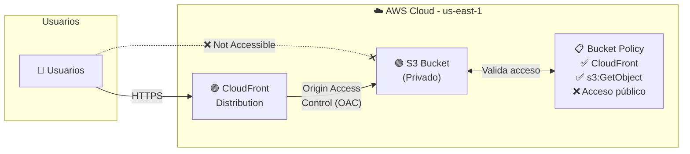

# Documento de Diseño: Sitio Web Estático con S3 y CloudFront

## Visión General

Este diseño describe la infraestructura Terraform necesaria para desplegar un sitio web estático en AWS, utilizando S3 como almacenamiento de origen y CloudFront como CDN. La arquitectura sigue el patrón estándar de sitio estático seguro: el bucket S3 permanece privado y solo es accesible a través de CloudFront mediante Origin Access Control (OAC).

Los archivos Terraform se ubicarán en el directorio `kiro_aws/` del workspace, organizados en archivos separados siguiendo las mejores prácticas de Terraform: `providers.tf`, `main.tf`, `variables.tf` y `outputs.tf`. Se incluirán archivos HTML iniciales (`index.html` y `error.html`) para verificación inmediata del despliegue.

**Decisiones clave de diseño:**
- Se usa OAC (no OAI) ya que es el mecanismo recomendado por AWS para nuevas distribuciones.
- Se utiliza `PriceClass_100` para optimizar costos limitando las ubicaciones de borde a Norteamérica y Europa.
- Se configura la política de caché gestionada `CachingOptimized` de AWS en lugar de una política personalizada.
- Los errores 403/404 se redirigen a `index.html` con código 200, patrón común para SPAs.

## Arquitectura

> **Nota:** Para un diagrama con iconos oficiales de AWS (como el ejemplo adjunto), se recomienda usar [draw.io](https://app.diagrams.net/) con la librería de AWS Architecture Icons. El siguiente diagrama Mermaid representa la misma arquitectura de forma textual.



### Flujo visual de la arquitectura (estilo AWS)

```
┌─────────────────────────────────────────────────────────────────────┐
│  ☁️  AWS Cloud (us-east-1)                                          │
│                                                                     │
│    ❌ Not Accessible (acceso directo bloqueado)                     │
│  ┌──────────────────────────────────────────────────────────────┐   │
│  │                                                              │   │
│  │  👥 ──── HTTPS ────▶ 🟣 CloudFront ── OAC ──▶ 🪣 S3 Bucket ◀──▶ 📋 Bucket Policy │
│  │  Usuarios              Distribution            (Privado)      ✅ CloudFront     │
│  │                         │                       │              ✅ s3:GetObject   │
│  │                         │                       ├─ index.html  ❌ Acceso público │
│  │                         │                       └─ error.html                    │
│  │                         │                                                        │
│  │                    Redirige HTTP→HTTPS                                           │
│  │                    Caché CachingOptimized                                        │
│  │                    Compresión habilitada                                         │
│  │                    PriceClass_100                                                │
│  └──────────────────────────────────────────────────────────────┘   │
└─────────────────────────────────────────────────────────────────────┘
```

### Flujo de solicitud

1. El usuario accede al dominio de CloudFront vía HTTPS.
2. CloudFront recibe la solicitud y la redirige a HTTPS si llega por HTTP.
3. CloudFront firma la solicitud al origen S3 usando OAC.
4. S3 valida la firma contra la Bucket Policy y sirve el contenido.
5. Si ocurre un error 403 o 404, CloudFront responde con `index.html` y código 200.

## Componentes e Interfaces

### 1. `providers.tf` — Configuración del proveedor

Configura el proveedor AWS con:
- Región: `us-east-1`
- Perfil: `VOP_AWS_Project_DEV`
- Versión mínima de Terraform: `>= 1.0`
- Versión mínima del proveedor AWS: `~> 5.0`

### 2. `main.tf` — Recursos principales

Define los siguientes recursos Terraform:

| Recurso | Tipo Terraform | Propósito |
|---------|---------------|-----------|
| S3 Bucket | `aws_s3_bucket` | Almacenamiento de archivos estáticos |
| Bloqueo acceso público | `aws_s3_bucket_public_access_block` | Bloquea todo acceso público al bucket |
| Versionado | `aws_s3_bucket_versioning` | Habilita versionado de objetos |
| Cifrado | `aws_s3_bucket_server_side_encryption_configuration` | SSE-S3 por defecto |
| CloudFront Distribution | `aws_cloudfront_distribution` | CDN para servir el sitio |
| OAC | `aws_cloudfront_origin_access_control` | Control de acceso al origen S3 |
| Bucket Policy | `aws_s3_bucket_policy` | Política que permite acceso solo desde CloudFront |
| Objetos S3 | `aws_s3_object` | Archivos index.html y error.html |

### 3. `variables.tf` — Variables parametrizables

| Variable | Tipo | Valor por defecto | Descripción |
|----------|------|-------------------|-------------|
| `project_name` | `string` | `"kiro-static-site"` | Nombre del proyecto para nombrar recursos |
| `environment` | `string` | `"dev"` | Entorno de despliegue |
| `aws_region` | `string` | `"us-east-1"` | Región AWS |
| `aws_profile` | `string` | `"VOP_AWS_Project_DEV"` | Perfil AWS CLI |
| `default_root_object` | `string` | `"index.html"` | Documento raíz de CloudFront |
| `price_class` | `string` | `"PriceClass_100"` | Clase de precio de CloudFront |
| `tags` | `map(string)` | `{Project, Environment, ManagedBy}` | Etiquetas comunes |

### 4. `outputs.tf` — Valores de salida

| Output | Valor | Descripción |
|--------|-------|-------------|
| `s3_bucket_name` | Nombre del bucket | Identificador del bucket S3 |
| `cloudfront_distribution_id` | ID de la distribución | ID de la distribución CloudFront |
| `cloudfront_domain_name` | Dominio de CloudFront | URL de acceso al sitio |
| `oac_arn` | ARN del OAC | ARN del Origin Access Control |

### 5. Archivos estáticos iniciales

- `index.html`: Página de inicio con contenido HTML5 básico que confirma el despliegue exitoso.
- `error.html`: Página de error personalizada con mensaje amigable.

Estos archivos se subirán al bucket S3 como objetos `aws_s3_object` dentro de `main.tf`.

## Modelos de Datos

### Estructura de archivos del proyecto

```
kiro_aws/
├── providers.tf      # Proveedor AWS y versiones requeridas
├── main.tf           # Todos los recursos (S3, CloudFront, OAC, Policy)
├── variables.tf      # Variables parametrizables con defaults
├── outputs.tf        # Outputs del despliegue
├── index.html        # Página de inicio del sitio estático
└── error.html        # Página de error personalizada
```

### Modelo de etiquetas (tags)

Todos los recursos que soporten etiquetas usarán el siguiente esquema:

```hcl
tags = {
  Project     = var.project_name
  Environment = var.environment
  ManagedBy   = "Terraform"
}
```

### Configuración de la Bucket Policy (JSON)

```json
{
  "Version": "2012-10-17",
  "Statement": [
    {
      "Sid": "AllowCloudFrontServicePrincipalReadOnly",
      "Effect": "Allow",
      "Principal": {
        "Service": "cloudfront.amazonaws.com"
      },
      "Action": "s3:GetObject",
      "Resource": "arn:aws:s3:::BUCKET_NAME/*",
      "Condition": {
        "StringEquals": {
          "AWS:SourceArn": "arn:aws:cloudfront::ACCOUNT_ID:distribution/DISTRIBUTION_ID"
        }
      }
    }
  ]
}
```

### Configuración de respuestas de error personalizadas

| Código de error origen | Código de respuesta | Página de respuesta | TTL caché (s) |
|------------------------|--------------------|--------------------|---------------|
| 403 | 200 | `/index.html` | 10 |
| 404 | 200 | `/index.html` | 10 |


## Propiedades de Correctitud

*Una propiedad es una característica o comportamiento que debe mantenerse verdadero en todas las ejecuciones válidas de un sistema — esencialmente, una declaración formal sobre lo que el sistema debe hacer. Las propiedades sirven como puente entre especificaciones legibles por humanos y garantías de correctitud verificables por máquinas.*

### Propiedad 1: El nombre del bucket contiene el identificador del proyecto

*Para cualquier* valor de la variable `project_name`, el nombre del bucket S3 creado debe contener dicho valor como parte de su nombre.

**Valida: Requisito 2.1**

### Propiedad 2: Todos los recursos etiquetables tienen las etiquetas requeridas

*Para cualquier* recurso Terraform que soporte etiquetas (S3 Bucket, CloudFront Distribution), el mapa de etiquetas debe contener las claves `Project`, `Environment` y `ManagedBy`.

**Valida: Requisitos 2.5, 3.7**

### Propiedad 3: Las respuestas de error personalizadas redirigen correctamente

*Para cualquier* código de error configurado en el conjunto {403, 404}, la respuesta personalizada de CloudFront debe devolver el documento `/index.html` con código de estado HTTP 200.

**Valida: Requisitos 5.1, 5.2**

### Propiedad 4: Todos los outputs requeridos están definidos

*Para cualquier* output requerido del conjunto {`s3_bucket_name`, `cloudfront_distribution_id`, `cloudfront_domain_name`, `oac_arn`}, el archivo `outputs.tf` debe definir un bloque output con ese nombre.

**Valida: Requisitos 7.1, 7.2, 7.3, 7.4**

### Propiedad 5: Todas las variables tienen descripción y valor por defecto

*Para cualquier* variable definida en `variables.tf`, debe incluir un atributo `description` no vacío y un atributo `default`.

**Valida: Requisito 8.2**

## Manejo de Errores

### Errores en tiempo de despliegue (Terraform)

| Escenario | Causa probable | Mitigación |
|-----------|---------------|------------|
| Nombre de bucket duplicado | El nombre S3 ya existe globalmente | Incluir un sufijo único (ej. account ID o random) en el nombre del bucket |
| Perfil AWS no encontrado | El perfil `VOP_AWS_Project_DEV` no está configurado en `~/.aws/credentials` | Documentar prerequisito de configuración del perfil AWS CLI |
| Permisos insuficientes | El perfil no tiene permisos para crear S3/CloudFront/OAC | Verificar que el rol IAM asociado tenga los permisos necesarios |
| Timeout en creación de CloudFront | La distribución puede tardar 10-15 minutos en desplegarse | Configurar timeouts adecuados en el recurso Terraform |

### Errores en tiempo de ejecución (sitio web)

| Escenario | Comportamiento esperado |
|-----------|------------------------|
| Ruta no encontrada (404) | CloudFront devuelve `index.html` con código 200 |
| Acceso directo al bucket S3 | Denegado — el bucket no tiene acceso público |
| Acceso HTTP (sin TLS) | CloudFront redirige automáticamente a HTTPS |
| Objeto no encontrado en S3 (403) | CloudFront devuelve `index.html` con código 200 |

## Estrategia de Testing

### Enfoque dual: Tests unitarios + Tests basados en propiedades

La estrategia de testing combina dos enfoques complementarios:

1. **Tests unitarios**: Verifican ejemplos específicos, casos borde y configuraciones concretas.
2. **Tests basados en propiedades**: Verifican propiedades universales que deben cumplirse para cualquier entrada válida.

### Herramienta de testing

Se utilizará **Terratest** (Go) como framework principal para validar la infraestructura Terraform, complementado con **testing/quick** (paquete estándar de Go) o **gopter** para tests basados en propiedades.

Alternativamente, se puede usar `terraform validate` y `terraform plan` como validación estática, junto con scripts de validación en Python con **Hypothesis** o en JavaScript con **fast-check** para las propiedades que operan sobre los archivos HCL parseados.

### Tests unitarios recomendados

- Verificar que `providers.tf` configura la región `us-east-1` y el perfil `VOP_AWS_Project_DEV` (Requisitos 1.1, 1.2)
- Verificar que existe el bloque `required_version` y `required_providers` (Requisito 1.3)
- Verificar que el bloqueo de acceso público tiene las 4 opciones en `true` (Requisito 2.2)
- Verificar que el versionado está habilitado (Requisito 2.3)
- Verificar que el cifrado SSE-S3 está configurado (Requisito 2.4)
- Verificar que CloudFront tiene el S3 bucket como origen (Requisito 3.1)
- Verificar que `viewer_protocol_policy` es `redirect-to-https` (Requisito 3.2)
- Verificar que el documento raíz es `index.html` (Requisito 3.3)
- Verificar que se usa la política de caché `CachingOptimized` (Requisito 3.4)
- Verificar que la compresión está habilitada (Requisito 3.5)
- Verificar que `price_class` es `PriceClass_100` (Requisito 3.6)
- Verificar que existe el recurso OAC con tipo `s3` y firma `always` (Requisitos 4.1, 4.3)
- Verificar que la bucket policy permite solo `s3:GetObject` desde `cloudfront.amazonaws.com` (Requisito 4.2)
- Verificar que existen `index.html` y `error.html` como objetos S3 (Requisitos 6.1, 6.2)
- Verificar que los archivos .tf están en el directorio `kiro_aws/` (Requisitos 8.1, 8.3)

### Tests basados en propiedades

Cada propiedad debe ejecutarse con un mínimo de 100 iteraciones.

- **Feature: s3-cloudfront-static-site, Property 1: El nombre del bucket contiene el identificador del proyecto** — Generar valores aleatorios de `project_name` y verificar que el nombre del bucket resultante los contiene.
- **Feature: s3-cloudfront-static-site, Property 2: Todos los recursos etiquetables tienen las etiquetas requeridas** — Para cada recurso etiquetable, verificar que las claves `Project`, `Environment` y `ManagedBy` están presentes.
- **Feature: s3-cloudfront-static-site, Property 3: Las respuestas de error personalizadas redirigen correctamente** — Para cada código de error en {403, 404}, verificar que la respuesta es `/index.html` con código 200.
- **Feature: s3-cloudfront-static-site, Property 4: Todos los outputs requeridos están definidos** — Para cada output requerido, verificar que existe en la configuración.
- **Feature: s3-cloudfront-static-site, Property 5: Todas las variables tienen descripción y valor por defecto** — Para cada variable definida, verificar que tiene `description` no vacío y `default`.
